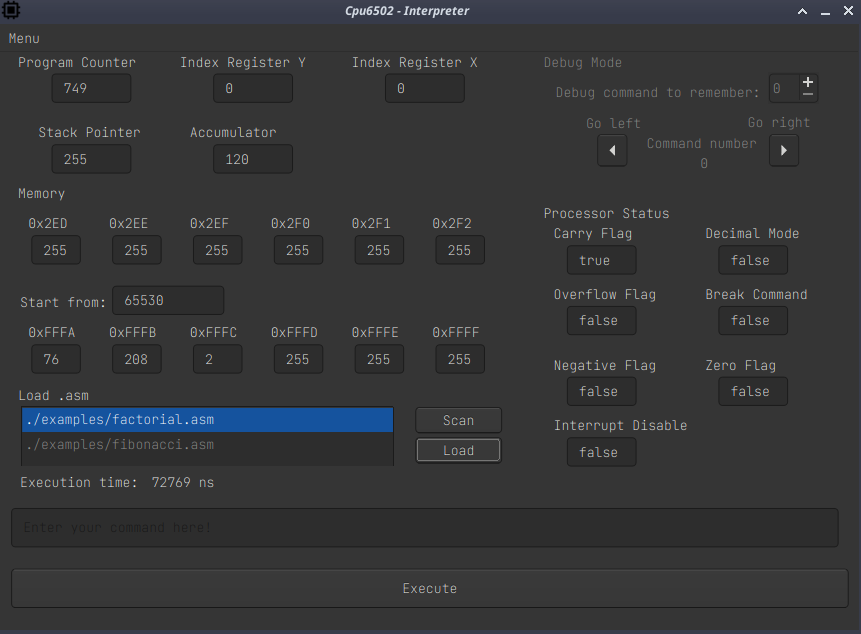

General info
---

Emulator processor 6502 with dummy interpreter and simple gui.

All instructions with description: https://www.masswerk.at/6502/6502_instruction_set.html

WORKFLOWS
---

| Ubuntu22| Debian12 | Arch linux | Code formatting |
| --------------- | -------------- | -------------- | -------------- |
| |||


SUBMODULES
---

- fmt [`https://github.com/fmtlib/fmt`]

BUILD
---

**Requirements:**

- `C++20  support`
- `Qt6`

**Build steps:**

- `git submodule init && git submodule update`
- `mkdir build && cd build`
- `cmake ../`
- `cmake --build . -j`

**Output files:**

- `cpu_6502_gui` - Qt6 GUI with interpreter
- `cpu_6502_tests` - Run interpreter and simulator tests.

GUI
---



EXAMPLES
---

- `examples/fibonacci.asm` - Calculate Fibonacci
- `examples/factorial.asm` - Calculate factorial

Docker and testing
---

```sh
make build        -	Build docker image
make test_gcc     -	Build with GCC and run cpu6502 unit/integration tests
make test_clang   -	Build with clang and run cpu6502 unit/integration tests
make clang_tidy   -	Run static code analysis
make check_format -	Check code formatting
make format       -	Format code
```
